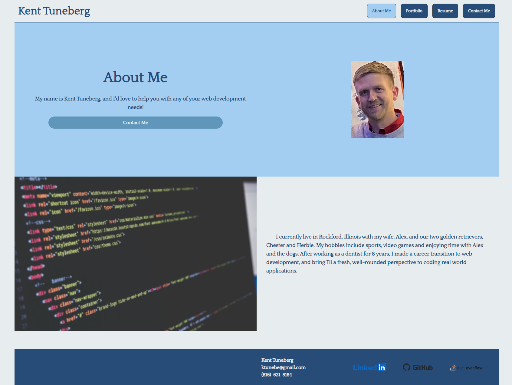
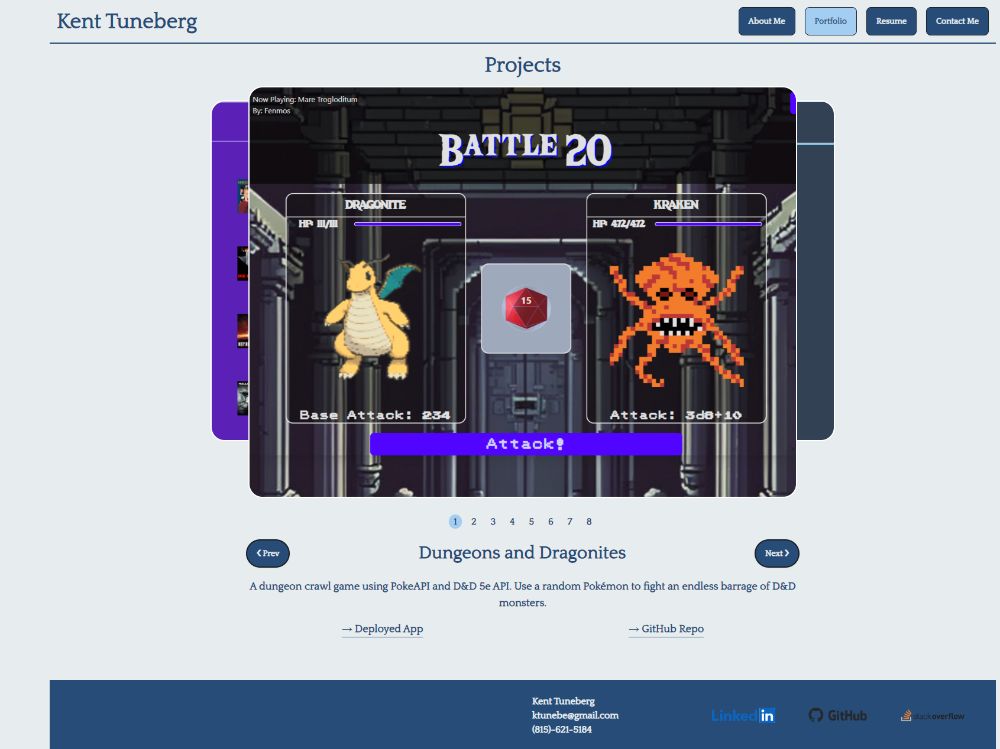

# react-portfolio

## Description

This is a project for UW Bootcamp in which we were asked to create a portfolio of our projects using React.js. 

## Installation

No installation needed.

## Usage

This single-page web app has an About Me section, a Portfolio section which will display our projects with links to each project's repo and deployment, a Resume section with a downloadable pdf, and a Contact Me section which will allow a user to send a message that will be sent to our email.

Link to deployed application: https://kent-tuneberg-coding.netlify.app/

About Me Page

Portfolio Page

## Credits

- Font
  - Quattrocento freeware font created by Pablo Impallari. See assets/fonts directory for information

## License

N/A

## Questions

Any questions about this application should be directed to:

GitHub: https://github.com/ktunebe

Email: ktunebe@gmail.com